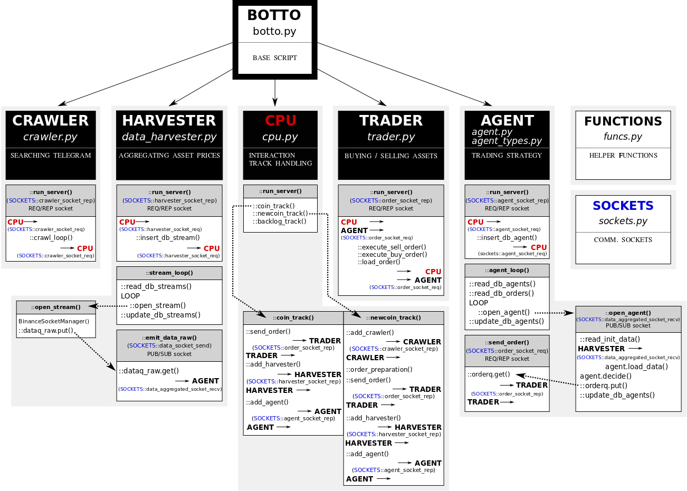

## BOTTO crypto trading bot
- [x] track (with Telegram) and buy newly introduced coins on Binance.
- [x] use basic strategies for short-term trading.
- [x] use external sources (CoinAPI) for price estimation.

Botto is suited for a specific strategy of tracing and trading newly introduced coins. Can be also used for usual trading strategies.

## Configuration
#### API configuration
Before starting BOTTO you must first prepare the config file in *cfg/auth.yml* with:
* Binance API keys (for the orders/trading):
  - **binance_api**: "BINANCE API KEY"
  - **binance_secret**: "BINANCE SECRET KEY"
* Telegram API keys (for the crawler):
  - **telegram_api_id**: "TELEGRAM API ID"
  - **telegram_api_hash**: "TELEGRAM API HASH"
  - **telegram_phone**: "TELEGRAM PHONE NUMBER"
* CoinAPI keys (new coin price estimation). This can be retrieved fast https://www.coinapi.io/):
  - **coinapi_apikey**: "COINAPI API KEY"
#### Tracks
Tracks describe Botto behaviour. Examples are given in the *tracks* dir.
## First run

```
python botto.py
```
which uses authentication info from *cfg/auth.yml* (fill it in!) and runs a strategy given by *tracks/new_coin_limit.yml*. It roughly does four things:
1. **looks** for a **new coin** on the Binance Telegram channel
2. after receiving a message on a new Binance listing, **estimates** its **initial price** based on historical data from coinAPI
3. **places** a **LIMIT order** at 0.9 \* estimated_price
4. **runs** a simple moving average **strategy** which sells the asset at either 1.2 \* estimated_price or 0.8 \* estimated_price.
## BOTTO logic



## Technology
Written in *python*. Uses *asyncio*, *SQLite* and *zxq*.
